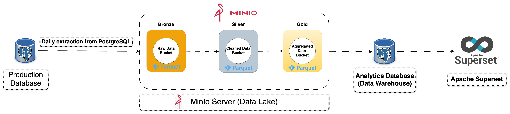
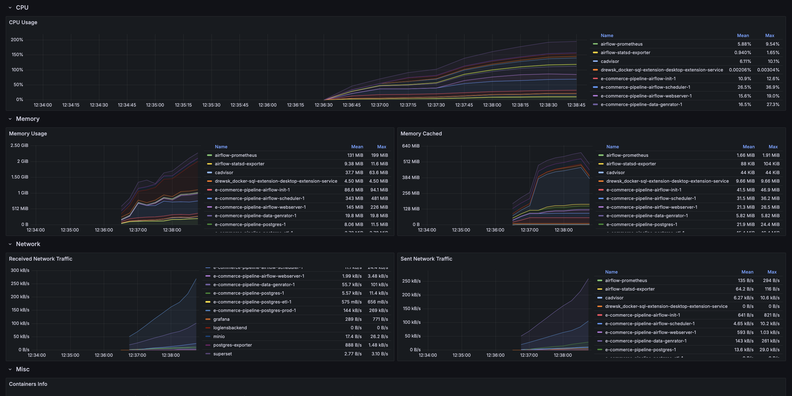
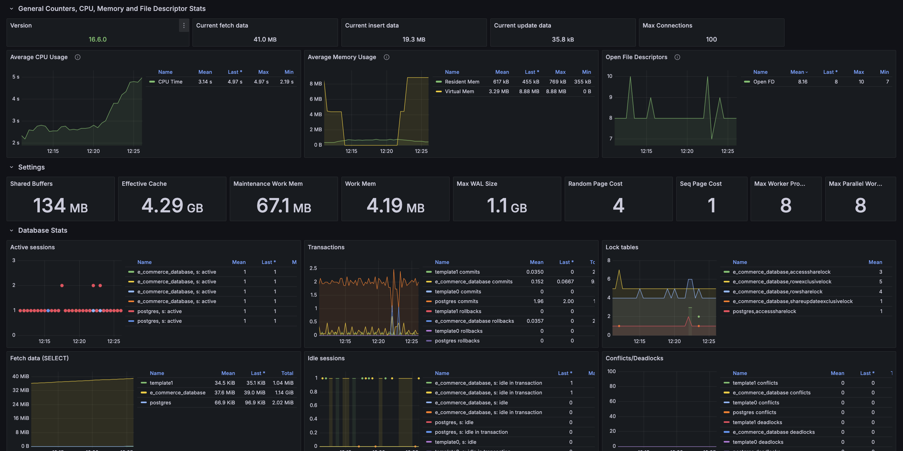
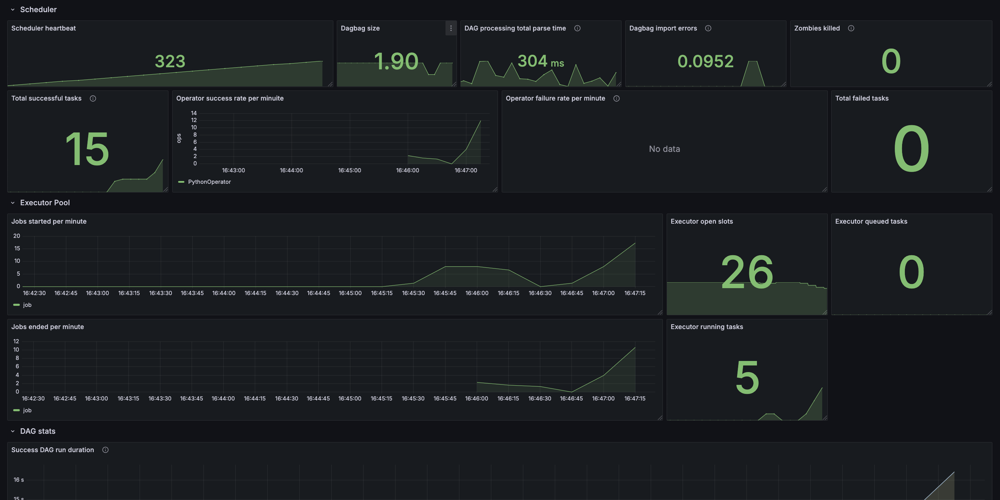
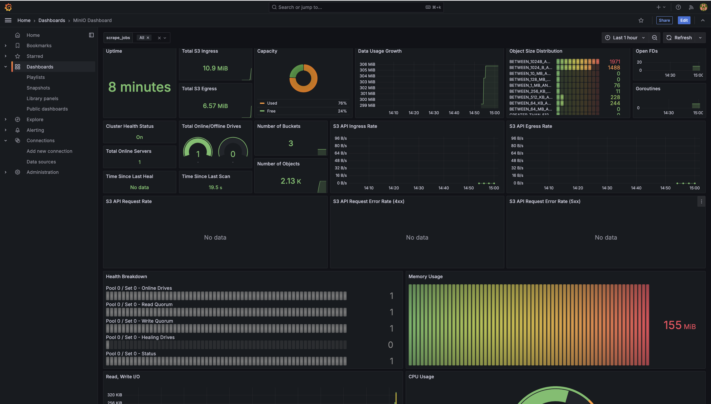

# E-commerce Data Pipeline & Analytics Dashboard 🚀📊

[](https://github.com/abrahamkoloboe27/Setup-Databases-With-Docker)
[](https://opensource.org/licenses/MIT)
[](https://www.docker.com)
[](https://docs.docker.com/compose/)
[](https://www.postgresql.org/)
[](https://min.io/)
[](https://superset.apache.org/)
[](https://parquet.apache.org/)
[](https://www.python.org/)
[](https://prometheus.io/)
[](https://github.com/statsd/statsd)
[](https://grafana.com/)
[](https://airflow.apache.org/)


## 🌟 Project Overview

A comprehensive data engineering platform for e-commerce including:
- 🧩 **Synthetic data generation** with Python Faker
- 🏗️ **ETL Pipeline** orchestrated by Apache Airflow
- 📦 **Structured Data Lake** (Bronze/Silver/Gold)
- 📊 **Interactive dashboards** with Apache Superset
- 🔍 **Real-time monitoring** via Grafana

## 🏗️ Global Architecture


### 📊 Key Components
| Component | Technologies | Emoji |
|-----------|--------------|-----------|
| **Orchestration** | Apache Airflow, Docker | ⚙️ |
| **Storage** | MinIO, PostgreSQL, Parquet | 💾 |
| **Transformation** | Python, Polars | 🔄 |
| **Visualization** | Apache Superset | 📈 |
| **Monitoring** | Prometheus, Grafana, cAdvisor | 📊 |

## 🗃️ Database Schemas

### 🛒 Production Database (OLTP)
  
*Relational structure optimized for transactions*

| Characteristic | Details |
|-----------------|---------|
| **Type** | Relational (PostgreSQL) |
| **Tables** | - users<br>- addresses<br>- categories<br>- products<br>- orders<br>- order_items<br>- payments<br>- shipments<br>- reviews<br>- product_views |
| **Indexes** | - idx_orders_user_id<br>- idx_orders_billing_address_id<br>- idx_orders_shipping_address_id<br>- idx_addresses_user_id<br>- idx_order_items_order_id<br>- idx_order_items_product_id<br>- idx_payments_order_id<br>- idx_shipments_order_id<br>- idx_reviews_user_id<br>- idx_reviews_product_id<br>- idx_product_views_user_id<br>- idx_product_views_product_id |
| **Optimization** | Normalization, Referential integrity constraints |

### 📈 Analytics Database (OLAP)
  
*Star schema for business analysis*

| Characteristic | Details |
|-----------------|---------|
| **Type** | Data Warehouse (PostgreSQL) |
| **Schema** | Star Schema |
| **Tables** | Fact_Sales, Fact_User_Activity, Fact_Product_Performance, Fact_Payment_Analytics, Dim_Products, Dim_Time, Dim_Geography, Dim_User, Dim_Payment_Method |
| **Indexes** | - idx_fact_sales_time<br>- idx_fact_sales_product<br>- idx_fact_user_geo<br>- idx_fact_payment_method<br>- idx_geography_country<br>- idx_geography_city<br>- idx_product_category<br>- idx_user_registration |

## 🛠️ Pipeline Components

### 📦 Data Generation
  
*Synthetic data generation workflow with Python Faker*

### 🔄 Orchestration Workflow
  
*Complete data flow from source to dashboards*

  
*ETL task management with Apache Airflow*

| Step | Tools | Output |
|-------|--------|--------|
| Extraction | Faker, PostgreSQL | 🗃️ Bronze Layer (MinIO) |
| Transformation | Polars, Python | 🧹 Silver Layer (Parquet) |
| Loading | SQL, dbt | 🏆 Gold Layer (PostgreSQL) |

## 📊 Monitoring & Visualization

### 🖥️ Operational Dashboarding
  
*Real-time business KPIs with Apache Superset*

| Metric | Tool | Emoji |
|----------|-------|-----------|
| Sales | Superset | 📈 |
| Performance | Grafana | 📉 |
| Logs | Prometheus | 📋 |

### 🔍 Monitoring Stack
  
*Container and metrics monitoring*

| Component | Function | Dashboard |
|-----------|----------|-----------|
| **cAdvisor** | Docker Monitoring |  |
| **Postgres-Exporter** | PostgreSQL Metrics |  |
| **StatsD-Exporter** | Airflow Metrics |  |
| **MinIo Server** | MinIO Metrics | |

## 🚀 Quick Start

### 📋 Prerequisites
| Component | Minimum | Recommended |
|-----------|---------|------------|
| CPU | 4 cores | 8 cores |
| RAM | 8GB | 16GB |
| Storage | 50GB SSD | 100GB NVMe |

```bash
git clone https://github.com/your-repo.git
cd e-commerce-pipeline
make build  # Build Docker images
make up  # Start containers
make build-up  # Build and start containers
make down  # Stop and remove containers
make down-volumes  # Remove containers and volumes
make down-volumes-build-up  # Remove containers, volumes, and build new images
```
### 🔗 Service Access
| Service | URL | Credentials | Port |
|---------|-----|------------|------|
| Airflow | http://localhost:8080 | admin/admin | 8080 |
| MinIO | http://localhost:9001 | minioadmin/minioadmin | 9001 |
| Superset | http://localhost:8088 | admin/admin | 8088 |
| Grafana  | http://localhost:3000 | grafana/grafana | 3000 |

## 📌 Features Highlights

| Feature | Technology | Benefit |
|---------|------------|---------|
| Hierarchical Data Lake | MinIO + Parquet | 🏷️ Raw/transformed data structuring |
| Modular ETL | Airflow + Python | 🔄 Workflow reproducibility |
| Unified Monitoring | Grafana + Prometheus | 📊 360° performance view |

## 📜 License & Contact

📄 **License**: [MIT](LICENSE)  
📧 **Contact**: [abklb27@gmail.com](mailto:abklb27@gmail.com)  
👨💻 **Author**: [Abraham Koloboe](https://linkedin.com/in/your-profile)


**[⬆ Back to top](#e-commerce-data-pipeline--analytics-dashboard-)**  
*✨ Made with passion for data engineering!*
