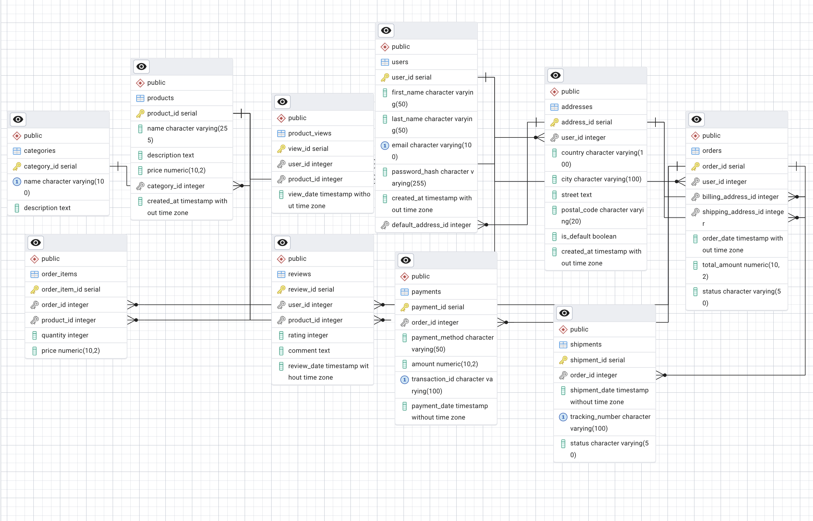
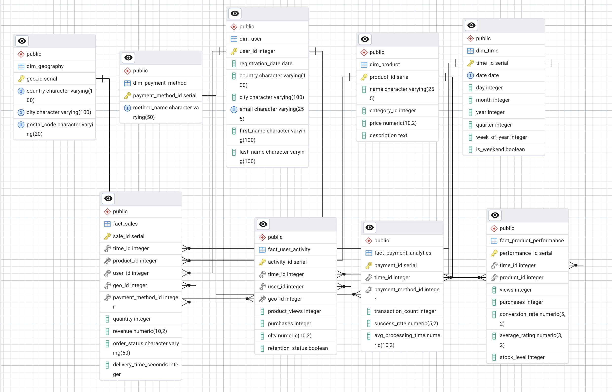
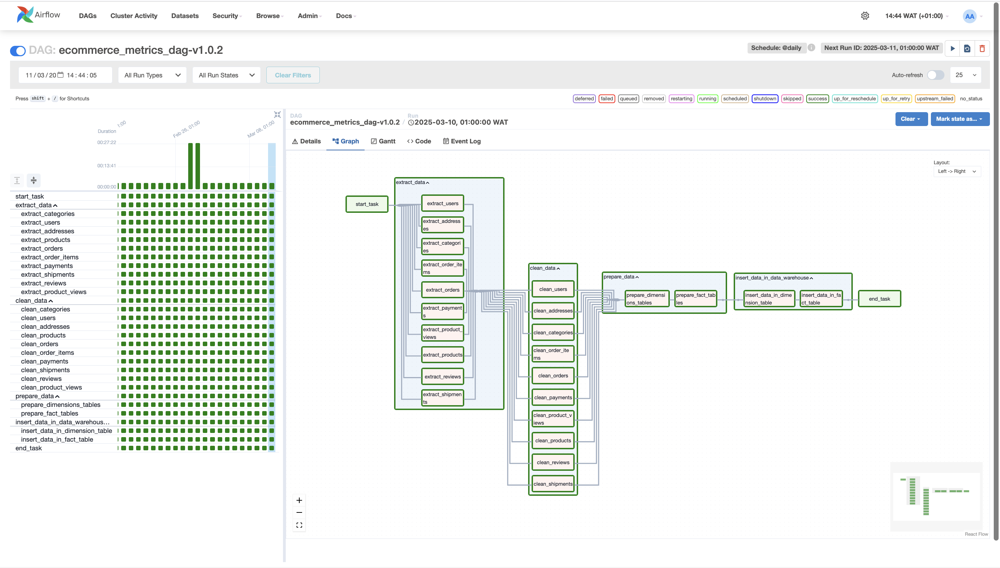
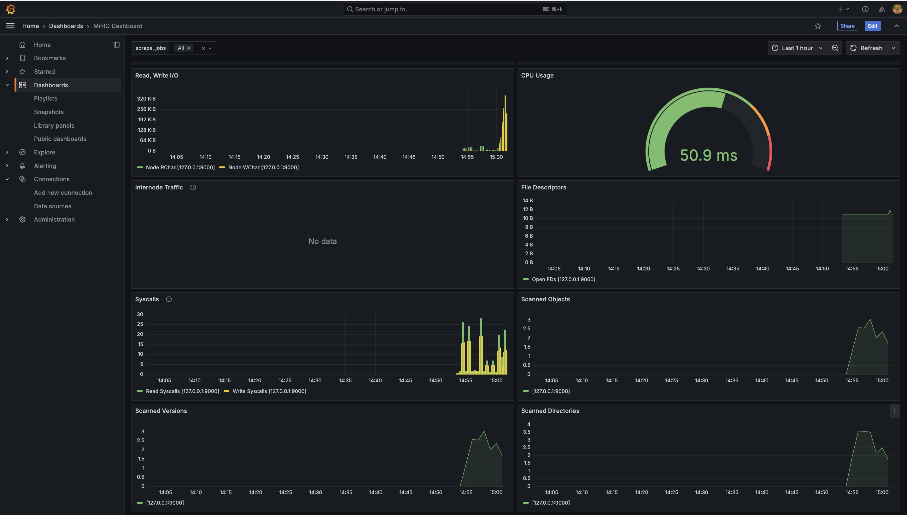
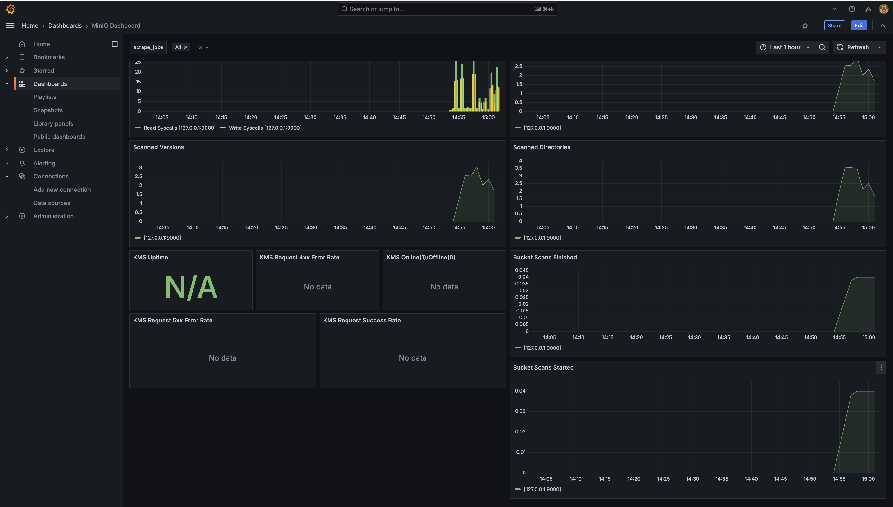
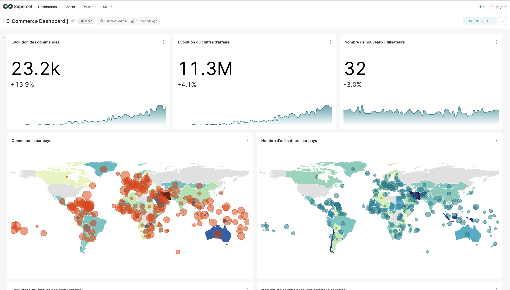

# E-commerce Data Pipeline & Analytics Dashboard 🚀📊

[](https://github.com/abrahamkoloboe27/Setup-Databases-With-Docker)
[](https://opensource.org/licenses/MIT)
[](https://www.docker.com)
[](https://docs.docker.com/compose/)
[](https://www.postgresql.org/)
[](https://min.io/)
[](https://superset.apache.org/)
[](https://parquet.apache.org/)
[](https://www.python.org/)
[](https://prometheus.io/)
[](https://github.com/statsd/statsd)
[](https://grafana.com/)
[](https://airflow.apache.org/)

## Project Overview 🎯

A comprehensive data pipeline solution for an e-commerce platform, featuring:
- 🔄 **Data Generation**: Synthetic data creation using Python & Faker
- 🔁 **ETL Pipeline**: Data extraction, transformation, and loading
- 💾 **Data Lake Architecture**: Bronze, Silver, and Gold layer implementation
- 📊 **Analytics & Visualization**: Interactive dashboards with Apache Superset

## Architecture 🏗️


*Complete architecture overview of the E-commerce data pipeline*

### Database Designs 💾

#### Production Database Schema

*OLTP database schema*


#### Analytics Database Schema



*Dimension and fact tables structure*

### Pipeline Implementation 🔧

#### Apache Airflow DAG

*Data pipeline workflow showing task dependencies*

#### MinIO Data Lake Organization

*Data Lake structure with Bronze, Silver, and Gold layers*

### Monitoring & Analytics 📊

#### Grafana Monitoring Dashboards

*Monitoring Architecture*


*System resource utilization*


*Pipeline execution metrics*

#### Apache Superset Analytics

*Business performance metrics*


*Customer behavior and sales analysis*

### Components Overview 🔍

| Layer | Components | Technologies |
|-------|------------|--------------|
| **Data Source** 📝 | - Data Generator<br>- Production Database |    |
| **Orchestration** ⚙️ | - Workflow Management<br>- Task Scheduling |  |
| **Data Lake** 💧 | - Bronze Layer<br>- Silver Layer<br>- Gold Layer |   |
| **Data Warehouse** 🏢 | - Analytics Database<br>- Star Schema |  |
| **Visualization** 📈 | - Dashboards<br>- KPI Monitoring |  |
| **Monitoring** 🔍 | - Metrics Collection<br>- Performance Monitoring |    |

## Technology Stack 🛠️

### Development Tools 💻
| Tool | Version | Purpose |
|------|---------|----------|
|  Docker | 20.10+ | Containerization |
|  Python | 3.10+ | Development |
|  VS Code | Latest | IDE |

### Data Processing 🔄
| Tool | Purpose | Badge |
|------|----------|-------|
| Polars | Data transformation |  |
| Parquet | Data storage |  |

## Quick Start 🚀

### System Requirements 🖥️
| Component | Minimum | Recommended |
|-----------|---------|-------------|
| CPU | 4 cores | 8 cores |
| RAM | 8GB | 16GB |
| Storage | 20GB | 50GB |
| OS | macOS/Linux | macOS/Linux |

1. **Clone the repository**
```bash
git clone https://github.com/abrahamkoloboe27/e-commerce-pipeline.git
cd e-commerce-pipeline
```

2. **Start the infrastructure**
```bash
docker-compose up -d
```

3. **Initialize the databases**
```bash
docker-compose exec postgres psql -U postgres -f /init-prod.sql
```

### Access Points 🔗

| Service | URL | Credentials | Logo |
|---------|-----|-------------|------|
| Airflow | http://localhost:8080 | admin/admin |  |
| MinIO Console | http://localhost:9001 | minioadmin/minioadmin |  |
| Superset | http://localhost:8088 | admin/admin |  |
| Grafana | http://localhost:3000 | admin/admin |  |

## Pipeline Workflow 🔄

### Data Flow Summary 📊

| Stage | Input | Output | Technology |
|-------|--------|---------|------------|
| Extraction 📥 | PostgreSQL 🐘 | MinIO (raw-data) ☁️ | Airflow 🌬️, Polars 🐻‍❄️ |
| Processing 🔄 | raw-data bucket 📦 | cleaned-data bucket ✨ | Polars 🐻‍❄️ |
| Aggregation 📊 | cleaned-data bucket ✨ | aggregated-data bucket 📈 | Polars 🐻‍❄️ |
| Loading 📋 | aggregated-data bucket 📈 | PostgreSQL Analytics 🎯 | Polars 🐻‍❄️ |
| Visualization 📈 | Analytics Database 🏢 | Dashboards 📊 | Superset 🎨 |

1. **Data Extraction (Bronze Layer)** 🔍
   - Daily extraction from PostgreSQL 🕒
   - Raw data storage in MinIO `raw-data` bucket 💾

2. **Data Processing (Silver Layer)** ⚙️
   - Data cleaning and validation in `cleaned-data` bucket 🧹
   - Schema standardization 📝
   - Quality checks ✅

3. **Data Aggregation (Gold Layer)** 🏆
   - Data aggregation in `aggregated-data` bucket 📊
   - KPI calculation 📈
   - Business metrics computation 💡

4. **Data Loading** 🔄
   - Loading into Analytics PostgreSQL database 📥
   - Fact and dimension tables creation 🏗️
   - Star schema implementation ⭐

5. **Data Visualization** 🎨
   - Connection to Analytics database 🔌
   - Real-time dashboards ⚡
   - Business insights visualization 📊

## Monitoring & Observability 📊

- Real-time pipeline monitoring
- Data quality metrics
- System performance dashboards
- Alert configuration

## Future Enhancements 🔮

- [ ] Data quality validation with Great Expectations
- [ ] Advanced ML pipeline integration
- [ ] Real-time streaming capabilities

## About 👨‍💻

Developed by Abraham KOLOBOE. For questions or collaboration:

- 📧 **Email**: abklb27@gmail.com
- 💼 **LinkedIn**: [Abraham KOLOBOE](https://www.linkedin.com/in/abraham-zacharie-koloboe-data-science-ia-generative-llms-machine-learning/)
- 🐙 **GitHub**: [abrahamkoloboe27](https://github.com/abrahamkoloboe27)

## License 📄

This project is licensed under the MIT License - see the [LICENSE](LICENSE) file for details.
